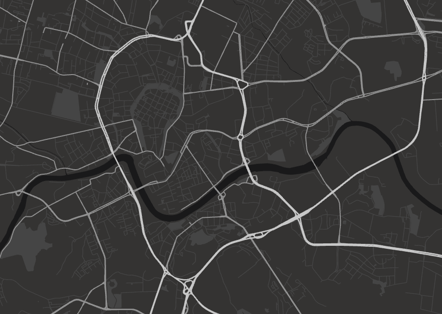

# webgl-maps



WebGL map renderer written from scratch for fun.

- Downloads data from OpenStreetMap.
- Processes it using tiny triangulation utilities for converting it to triangles for GPU to render.
- Renders it using a mini WebGL engine.

## Install

You can install all dependencies by typing `yarn` in the main directory (uses yarn workspace).

```
yarn
```

## Usage

1. Enter `assets/`.
2. Type `yarn start`. A file with data will be downloaded.
3. Rename it to `data.json` (or provide this name as a param to `yarn start`).
4. Move `data.json` to `client/src`.
5. Start client with `yarn start`.
6. Visit `localhost:3000`.

## How it works

Below you can read a bit more detailed story about how it works and why.

### Historical background

Rendering maps is based on tiles. In so called [web mercator projection](https://tchayen.github.io/web-mercator-projection), the math used there projects earth to a perfect square. It makes it a perfect opportunity to recursively divide maps into 4 smaller square segments.

The maps used to be rendered by serving prerendered images of the tiles. All the browser had to calculate was which tiles occupy the screen and what should be downloaded.

Nowadays map renderers are migrating to be WebGL based. It makes it possible to do a lot of _dynamic_ rendering which was absolutely no option during days of image maps.

Those engines still use tiling, but now they are serving portions of data that is renderered _client-side_ (to make things simpler in this project I skip the tiling completely and just render whole area).

### Obtaining geographical data

When it comes to rendering, the engine must have some source of data. It's hard to argue that OpenStreetMap provides the biggest collection of information necessary for rendering _typical_ maps.

Fetching data from OSM is a really broad topic on its own, so I will just say I used Overpass API for the job with help of the great [Overpass Turbo](http://overpass-turbo.eu) website for checking if my assumptions of what Overpass API does correlate with what it really does.

The fetching is automated and present in `assets/fetch.ts` script.

### Getting from points on sphere to flat triangles :earth_africa:

With the data downloaded, we are definitely one huge step closer to having the map, but it is not immediately clear what to do next.

We should notice that the data we've just downloaded is based on points using _longitude_ and _latitude_ coordinates. To take it from sphere :globe_with_meridians: to a flat surface :pencil: (like our map), we use [web mercator projection](https://tchayen.github.io/web-mercator-projection).

Now that we have abstract points in 2D space, we need to render them using the GPU. The current problem is that we have shapes defined as polygons or lines, which are sequences of points. We need triangles :small_red_triangle:. For that we use [Ear clipping method :ear: :scissors:](https://en.wikipedia.org/wiki/Polygon_triangulation) for simple triangulation (and even simpler algorithm for replacing lines with chain of rectangles of given width).

Having the triangles which GPU can definitely render, we are now quite close to our goal.

### Rendering in WebGL

The last step is writing typical WebGL renderer. We have to write some shaders, compile them into programs, setup projection matrix and so on. The hard think here is making sure that our data is properly scaled and translated so we will actually see it on the screen. This step can cause a lot of pain and debugging.

After overcoming those difficulties we get our map rendered on screen :tada:.

## What else is left to do

### Tiling :cloud:

If we wanted to have a bigger map we will definitely need to implement tiling. This involves having a custom format for the data that comes in that you render and then writing a server capable of serving that.

### Jagged road edges

If you zoom in, you will notice that roads have characteristic jagged edges. Fixing it is not as easy as it might seem. Choosing other algorithm for triangulating lines won't help much since those are often separate objects (called _features_) in the GeoJSON format. They would have to be connected first and only after that enhanced to look better.

### Labels :label:

Having labels on the map is very complicated issue. First thing is having text at all. Since we went with custom WebGL renderer, there is no HTML DOM to save us (or maybe there is, but then you'd have correlate it with map orientation and make sure it renders smooth without lagging behind the map). So we've got to implement text rendering. This is so complicated issue on its own that it has [several competing solutions](https://stackoverflow.com/questions/25956272/better-quality-text-in-webgl) and none of them is perfect.

With the first problem solved you only enter a collection of even bigger and not obvious problems which is how, when and where render those labels. It depends on so many factors it is hard to decide where to start. You have to display different kind of labels depending on the zoom. You don't want to display city label when user has already zoomed in so much it covers their whole screen. You can only fit several on the screen and have to pick those most important or relevant (you've probably noticed that some time ago Google started to show different labels depending on the context; it was possible thanks to the WebGL dynamic renderer).

### Buildings :house_with_garden:

You can take buildings data from OpenStreetMap and render it as is, but it might not be the best idea. OSM tries to picture reality as closely as it can. It seems to be what we want, but actually it's not true. First of all, we want to have _pretty_ maps that users want to watch. If there is too much going on somewhere on the screen, it is our fault we didn't clear the data before showing it to the user. And that is definitely the case here.

For having good user experience with displaying building, you would need some kind of polygon simplification algorithm. And there aren't many of them. In fact, at the moment of writing I haven't found any that would fit those needs.

### 3D

If you manage to render buildings, it is good opportunity to use our huge advantage of having full blown rasterization engine allowing us to render 3D shapes. It's time for changing our map into something that looks more like a 3D simulation.
